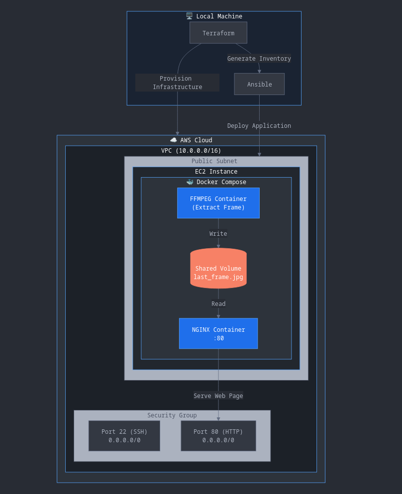

# 🎬 FFMPEG Video Frame Extractor

> *Automated infrastructure deployment for extracting and serving video frames via Docker, orchestrated with Terraform and Ansible.*

A fully automated solution that provisions AWS infrastructure and deploys a containerized FFMPEG + NGINX application to extract and display the last frame from a video stream. The entire stack is managed as code with zero-touch deployment.

---

## 🎯 Overview

This project demonstrates Infrastructure as Code (IaC) best practices by combining:
- **Terraform** for AWS infrastructure provisioning
- **Ansible** for automated application deployment  
- **Docker Compose** for container orchestration
- **FFMPEG** for video processing
- **NGINX** for web serving
- **AWS** CLI Authentication, which will save the profile to ~/.aws/credentials

**One-command deployment:** Simply run `terraform apply` and the entire infrastructure, networking, compute, and application stack deploys automatically.

---

## 🏗️ Architecture


---

## 📋 Prerequisites

Ensure the following tools are installed on your local machine:

| Tool | Purpose | Installation |
|------|---------|-------------|
| **Terraform** | Infrastructure provisioning | [Download](https://www.terraform.io/downloads) |
| **Ansible** | Configuration management | `pip install ansible` |
| **AWS CLI** | AWS authentication | [Install Guide](https://aws.amazon.com/cli/) |
| **Python 3** | Required by Ansible | Usually pre-installed |

**AWS Configuration:**
- Configure AWS CLI with valid credentials: `aws configure`
- Set your profile in `terraform.tfvars` 
- Ensure your AWS account has permissions to create VPCs, EC2 instances, and security groups

---

## 📁 Project Structure

```
.
├── terraform-infra/
│   │   ├── vpc.tf              # VPC with 2 public subnets
│   │   ├── ec2.tf              # EC2 instance with security rules
│   │   ├── keys.tf             # Auto-generated SSH key pair
│   │   ├── data.tf             # Ubuntu AMI lookup
│   │   └── ansible.tf          # Ansible automation trigger
│   │   ├── variables.tf        # Input variables
│   │   ├── terraform.tfvars    # Variable values
│   │   ├── locals.tf           # Local computed values
│   │   ├── outputs.tf          # Output values (IP, instance ID)
│   │   └── providers.tf        # Provider versions and config
│   └── templates/
│       └── inventory.tpl       # Ansible inventory template
├── ansible/
│   ├── inventory.ini           # Auto-generated by Terraform
│   └── deploy.yml              # Deployment playbook
└── app/
    ├── Dockerfile              # Custom FFMPEG image
    ├── docker-compose.yaml     # Container orchestration
    ├── ffmpeg-lastframe.sh     # Frame extraction script
    └── index.html              # Web interface
```

---

## 🚀 How It Works

### Infrastructure Layer (Terraform)

**1. VPC & Networking (`vpc.tf`)**
- Creates a VPC with CIDR `10.0.0.0/16`
- Provisions 2 public subnets across availability zones: 
  - `10.0.1.0/24` in `${region}a`
  - `10.0.2.0/24` in `${region}b`
- NAT Gateway disabled (public-only architecture)
- Uses Anton Babenko's official VPC module

**2. EC2 Instance (`ec2.tf`)**
- Launches Ubuntu 22.04 LTS (latest AMI auto-selected via data source)
- Instance type: `t3.micro` (configurable)
- Deployed in first public subnet with auto-assigned public IP
- Security group rules:
  - Port 22 (SSH) - Open to My Local IP, configured through a Terraform data source
  - Port 80 (HTTP) - Open to world (0.0.0.0/0)
- Uses Anton Babenko's EC2 instance module

**3. SSH Key Management (`keys.tf`)**
- Generates 2048-bit RSA key pair via TLS provider
- Saves private key as `.pem` file in terraform directory
- Lifecycle policy prevents key regeneration on updates
- Key permissions automatically set to `400`

**4. Ansible Integration (`ansible.tf`)**
- Automatically generates `ansible/inventory.ini` from template
- Uses absolute path to SSH key for reliability
- Waits 30 seconds for EC2 instance to be SSH-ready
- Triggers Ansible playbook automatically after infrastructure is ready
- Re-runs deployment if inventory changes

### Application Layer (Docker)

**1. FFMPEG Container (`Dockerfile`)**
- Base image: `jrottenberg/ffmpeg:7-ubuntu`
- Installs `bc` (binary calculator) for duration math
- Copies and executes `ffmpeg-lastframe.sh`
- Runs once and exits after extracting frame
- Cleans up apt metadata to reduce image size

**2. Frame Extraction Script (`ffmpeg-lastframe.sh`)**
```bash
# 1. Get total video duration using ffprobe
DURATION=$(ffprobe -v error -show_entries format=duration ...)

# 2. Calculate seek position (duration - 0.1 seconds)
SEEK_TIME=$(echo "$DURATION - 0.1" | bc -l)

# 3. Extract last frame with high quality
ffmpeg -ss "$SEEK_TIME" -i "$INPUT_VIDEO" -vframes 1 -q:v 1 -y "$OUTPUT_IMAGE"
```

**How it works:**
- Uses `ffprobe` to determine video length
- Calculates exact timestamp for last frame (0.1s before end)
- Extracts single frame with maximum quality (`-q:v 1`)
- Saves to shared volume as `last_frame.jpg`

**3. Docker Compose Orchestration (`docker-compose.yaml`)**

Two services connected via shared volume:

**FFMPEG Service:**
- Builds custom image from Dockerfile
- Runs once (`restart: no`)
- Mounts `shared-output` volume to `/output`
- Exits after successful frame extraction

**NGINX Service:**
- Uses official `nginx:latest` image
- Depends on FFMPEG completion (`service_completed_successfully`)
- Mounts same `shared-output` volume to web root
- Overlays custom `index.html` for UI
- Exposes port 80 to host

### Deployment Layer (Ansible)

**Playbook (`deploy.yml`) executes these tasks:**

1. **System Preparation**
   - Updates APT cache
   - Installs dependencies (curl, gnupg, etc.)

2. **Docker Installation**
   - Adds Docker GPG key and repository
   - Installs Docker CE, CLI, and containerd
   - Enables Docker service

3. **Docker Compose Installation**
   - Downloads Docker Compose v2.23.0 binary
   - Installs to `/usr/local/bin/docker-compose`
   - Sets executable permissions

4. **Application Deployment**
   - Creates `/home/ffmpeg-app` directory
   - Copies all app files (Dockerfile, compose file, scripts, HTML)
   - Sets script permissions

5. **Container Management**
   - Stops any existing containers
   - Builds FFMPEG image
   - Starts both services
   - Waits for port 80 to be accessible

---

## 📖 Deployment Guide

### Configuration

Edit `terraform-infra/terraform.tfvars` to customize:

```hcl
aws_region       = "eu-north-1"           # AWS region
key_name         = "ffmpeg-project-key"   # SSH key name
instance_name    = "ffmpeg-project-instance"
instance_type    = "t3.micro"             # EC2 instance size
aws_auth_profile = "default"              # AWS CLI profile
vpc_name         = "ffmpeg-vpc"           # VPC name
```

### Deployment

**Single-command deployment:**

```bash
cd terraform-infra
terraform init
terraform apply
```

Type `yes` when prompted. Terraform will:
1. ✅ Create VPC and subnets
2. ✅ Launch EC2 instance
3. ✅ Generate SSH key pair
4. ✅ Configure security groups
5. ✅ Generate Ansible inventory
6. ✅ Wait for instance readiness
7. ✅ Run Ansible playbook
8. ✅ Deploy Docker containers

**Estimated time:** 3-5 minutes

### Verification

**View outputs:**
```bash
terraform output
```

**Access the application:**
```
http://<instance_public_ip>
```

You should see a web page displaying the last frame from Big Buck Bunny!

---

## 🧹 Cleanup

To destroy all AWS resources:

```bash
cd terraform-infra
terraform destroy
```

Type `yes` when prompted. This will:
- Terminate EC2 instance
- Delete security groups
- Remove VPC and subnets  
- Clean up SSH keys

**Note:** Local `.pem` file and Ansible inventory remain on disk. Delete manually if desired.

---

## 🔧 Technical Details

### Terraform Features Used

- **Modules:** Anton Babenko's community modules for VPC and EC2
- **Data Sources:** Dynamic AMI lookup, external IP detection
- **Locals:** Computed values (IP CIDR formatting)
- **Provisioners:** `local-exec` for Ansible automation
- **Lifecycle Rules:** Prevent SSH key regeneration
- **Templates:** Dynamic Ansible inventory generation
- **Null Resources:** Orchestration delays and triggers

### Docker Features Used

- **Shared volumes:** Inter-container communication
- **Depends_on conditions:** Service completion tracking
- **Layer caching:** Efficient rebuilds

### Ansible Features Used

- **Variables:** Reusable configuration values
- **Handlers:** Could be added for service restarts
- **Wait_for:** Application readiness checks
- **Copy module:** Efficient file transfer

---

## 🎯 Key Design Decisions

**Why this architecture?**

1. **Single-command deployment** - Entire stack via `terraform apply`
2. **Immutable infrastructure** - Terraform manages all resources
3. **Separation of concerns** - Infrastructure, config, and app layers
4. **Community modules** - Production-tested, maintained code
5. **Auto-generated inventory** - No manual Ansible configuration
6. **Stateless FFMPEG** - Runs once, stores result, exits
7. **Shared volumes** - Clean container communication


---

## 🚀 Improvements & Next Steps

**Implemented:**
- ✅ Automated infrastructure provisioning
- ✅ Zero-touch deployment
- ✅ Container orchestration
- ✅ Auto-generated inventory
- ✅ Restrict SSH to specific IP using `local.my_ip`
- ✅ Lifecycle management for keys

**Potential enhancements:**

- [ ] Add S3 backend for Terraform state
- [ ] Implement CI/CD with GitHub Actions
- [ ] Add validations for variables

---

**Built using Terraform, Ansible, Docker, FFMPEG, and NGINX**

*Demonstrates: Infrastructure as Code, Configuration Management, Containerization, Automation*# 🎬 FFMPEG Video Frame Extractor

